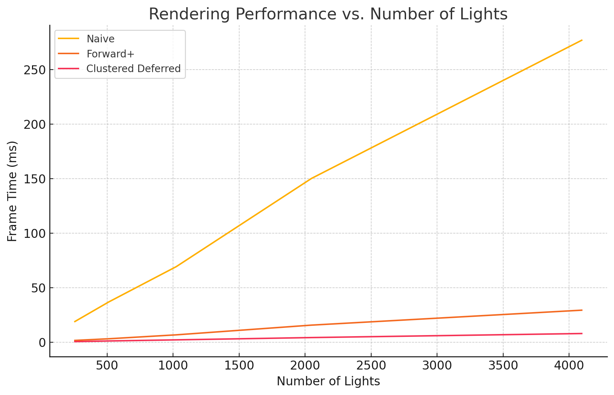

WebGL Forward+ and Clustered Deferred Shading
======================

**University of Pennsylvania, CIS 5650: GPU Programming and Architecture, Project 3**

* Shreyas Singh
    * [LinkedIn](https://linkedin.com/in/shreyassinghiitr)
* Tested on: Apple MacBook Pro, Apple M2 Pro @ 3.49 GHz, 19-core GPU

### Demo Video/GIF

### Project Overview
This project demonstrates three different real-time rendering modes in WebGPU:

1. **Naive Forward Rendering**:
The naive renderer uses a traditional forward pipeline where lighting calculations are performed for every pixel against all lights in the scene. While this method is fairly simple, this approach becomes inefficient as the number of lights increases.

2. **Forward+ Rendering**:
The Forward+ technique improves performance by dividing the camera frustum into a 3D grid of clusters. A compute shader determines which lights influence each cluster, and each pixel only computes lighting for the lights relevant to its cluster. This reduces unnecessary lighting calculations, especially in scenes with many lights.

3. **Clustered Deferred Rendering**:
Clustered Deferred builds on Forward+ by introducing deferred shading. The first pass writes color, normals, and depth to textures (a G-buffer). In the next pass, lighting is computed only for the lights relevant to the cluster, reconstructing positions from depth. This further separates geometry and lighting, thus optimizing scenes with complex lighting.

The UT allows for toggling between rendering modes and adjust the number of active lights at the top right.

### Performance Analysis:
The table below indicates the rendering time (in ms) with respect to the number of lights in the scene. All tests have been done on the Sponza Atrium model.

| Number of Lights | Naive (ms) | Forward+ (ms) | Clustered Deferred (ms)|
| ---------------- | ----- | -------- | ------------------ |
| 256              | 19.0  | 1.7      | 0.6                |
| 512              | 36.9  | 3.2      | 1.2                |
| 1024             | 69.3  | 6.8      | 2.2                |
| 2048             | 150.1 | 15.7     | 4.3                |
| 4096             | 276.8 | 29.4     | 8.0                |

The inference from the chart can be summarized as: 

 - Naive rendering: Scales linearly with light count and becomes prohibitively slow at high light counts.

- Forward+ Rendering : Cuts per-frame cost by about half compared to Naive, but still scales linearly with a much smaller slope—making it practical up to several thousand lights.

- Clustered Deferred: Further reduces render time, exhibiting similar linear scaling but at an even lower per-light overhead.

### Credits

- [Vite](https://vitejs.dev/)
- [loaders.gl](https://loaders.gl/)
- [dat.GUI](https://github.com/dataarts/dat.gui)
- [stats.js](https://github.com/mrdoob/stats.js)
- [wgpu-matrix](https://github.com/greggman/wgpu-matrix)
